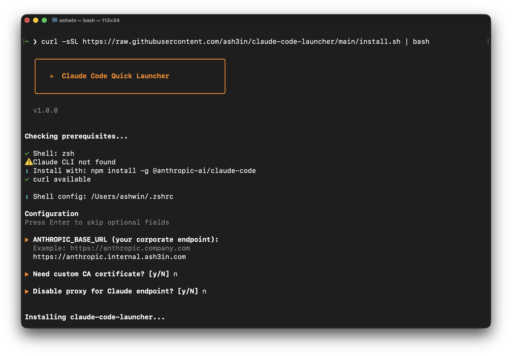

# claude-code-launcher

**Secure Claude Code Quick Launcher for Enterprise Users**

[](https://opensource.org/licenses/MIT)
[](https://www.gnu.org/software/bash/)
[](http://makeapullrequest.com)

A productivity tool for enterprise users accessing Claude Code through corporate endpoints with JWT authentication.



---

## The Problem

If you're an enterprise user accessing Claude Code through a corporate endpoint, you likely deal with:

1. **Refreshable JWT tokens** that expire periodically
2. **Multi-step setup** every time:
   ```bash
   export ANTHROPIC_AUTH_TOKEN="abCdeFghIjKL...long_token..."
   export ANTHROPIC_BASE_URL="https://your-anthropic-endpoint.internal"
   claude
   ```
3. **Token management headaches** - copying tokens, pasting correctly, checking expiry
4. **Security risks** - tokens in shell history, visible in `ps aux`

**Wouldn't it be nice to just type `cc` and be inside Claude Code?**

---

## The Solution

```bash
cc
```

That's it. One command.

---

## Features

| Feature | Description |
|---------|-------------|
| **One-command launch** | Just type `cc` |
| **Secure token storage** | Tokens never in shell history or process list |
| **Expiry tracking** | See remaining days in your prompt |
| **JWT validation** | Validates token format before storing |
| **Auto permission fixes** | Ensures token file is always `600` |
| **Interactive installer** | Guided setup wizard |

---

## Quick Install

```bash
curl -sSL https://raw.githubusercontent.com/ash3in/claude-code-launcher/main/install.sh | bash
```

The installer will:
1. Detect your shell (zsh/bash)
2. Guide you through configuration
3. Set up the `cc` command
4. Optionally install a fancy prompt with Claude indicator

---

## Usage

### Commands

| Command | Description |
|---------|-------------|
| `cc` | Launch Claude Code |
| `cc -t` | Store/update token (secure hidden input) |
| `cc -s` | Check token status, expiry, and config |
| `cc -h` | Show help |
| `cc -v` | Show version |

### First Time Setup

```bash
# 1. Run the installer
curl -sSL https://raw.githubusercontent.com/ash3in/claude-code-launcher/main/install.sh | bash

# 2. Reload your shell
source ~/.zshrc

# 3. Store your token (input is hidden)
cc -t
Token: <paste your JWT - not visible>

✓ Token stored securely
✓ Token valid for 30 days

# 4. Launch Claude Code
cc
```

### Daily Use

```bash
cc
# Claude Code launches immediately
```

### Check Status

```bash
cc -s

Claude Code Quick Launcher Status

✓ Token file permissions: 600 (secure)
✓ Token valid for 23 days
✓ Endpoint: https://anthropic.internal.company.com
✓ Claude CLI installed
```

### When Token Expires

```bash
cc
✗ Token EXPIRED 2 days ago
  Run: cc -t to update

cc -t
Token: <paste new token>
✓ Token stored securely
✓ Token valid for 30 days
```
---

## Security

> **Important:** This tool was developed in a controlled enterprise environment. Please read the full security disclaimer below before using.

### What This Protects Against

| Attack Vector | Protection |
|---------------|------------|
| **Shell history exposure** | Token input is hidden (`read -s`), never passed as CLI arg |
| **Process list snooping** | Token never appears in `ps aux` output |
| **File permission attacks** | Token file locked to `600` (owner read/write only) |
| **Invalid token injection** | JWT format validation before storage |
| **Stale permissions** | Auto-fixes file permissions on every launch |
| **Token leakage after exit** | Environment variable cleared when Claude exits |

### Security Architecture

```
┌──────────────────┐     ┌───────────────────┐     ┌──────────────────┐
│   User Input     │     │   Token Storage   │     │   Claude Code    │
│   (hidden)       │ ──▶ │   ~/.claude-token │ ──▶ │   (env var)      │
│   read -s        │     │   chmod 600       │     │   unset on exit  │
└──────────────────┘     └───────────────────┘     └──────────────────┘
        │                         │                        │
        ▼                         ▼                        ▼
   Never in history        Owner-only access        Scoped to session
   Never in ps aux         Validated JWT           Cleared after use
```

### What This Does NOT Protect Against

| Threat | Why |
|--------|-----|
| **Root/admin access compromise** | Root can read any file regardless of permissions |
| **Memory forensics** | Token exists in memory while Claude runs |
| **Keyloggers** | Token could be captured during input |
| **Shoulder surfing during token paste** | Physical security is your responsibility |
| **Compromised shell/terminal** | Malicious shell could intercept `read` |

### How Attackers Might Attack (And Our Mitigations)

| Attack | How It Works | Our Mitigation |
|--------|--------------|----------------|
| **History file theft** | Attacker reads `~/.zsh_history` | Token never in history (secure input) |
| **Process snooping** | `ps aux` to see command args | Token never in arguments |
| **File permission bypass** | Read world-readable files | File is `600` (owner-only) |
| **Token replay** | Stolen token used elsewhere | Use short-lived tokens + rotation |
| **Man-in-the-middle** | Intercept API traffic | HTTPS + certificate pinning |

---

## Important Security Disclaimer

**This tool was developed in a controlled enterprise environment with:**

- Corporate firewalls and network monitoring
- Endpoint detection and response (EDR) software
- Full disk encryption
- Managed device policies
- VPN and network segmentation

### Use At Your Own Risk

Before using this tool, ensure your environment has:

1. **Full Disk Encryption** - Protects token file if device is lost/stolen
2. **Strong User Authentication** - Password/biometric login to your machine
3. **No Shared User Accounts** - Only you should have access to your user account
4. **Updated Operating System** - Latest security patches installed
5. **Malware Protection** - Active antivirus/EDR solution

### Recommendations

- **Never use on shared computers**
- **Never use on public/untrusted networks** without VPN
- **Rotate tokens regularly** (your auth provider should enforce this)
- **Monitor for unauthorized access** to your Anthropic endpoint
- **Report suspicious activity** to your security team

---

## Manual Installation

If you prefer to install manually:

### 1. Add environment variables to `~/.zshrc`:

```bash
# Claude Code Environment
export ANTHROPIC_BASE_URL='https://your-anthropic-endpoint.internal'
export NO_PROXY='your-anthropic-endpoint.internal,localhost,127.0.0.1'
export NODE_EXTRA_CA_CERTS="$HOME/path/to/cacerts.pem"  # if needed
```

### 2. Copy the `cc` function from `cc.sh` to your `~/.zshrc`

### 3. Reload: `source ~/.zshrc`

---

## Uninstall

```bash
curl -sSL https://raw.githubusercontent.com/ash3in/claude-code-launcher/main/uninstall.sh | bash
```

Or manually:
1. Remove the `# cc-launcher START` to `# cc-launcher END` block from `~/.zshrc`
2. Delete `~/.claude-token`

---

## Configuration

### Environment Variables

| Variable | Description |
|----------|-------------|
| `ANTHROPIC_BASE_URL` | Your corporate Claude endpoint |
| `ANTHROPIC_AUTH_TOKEN` | Set automatically by `cc` |
| `NO_PROXY` | Hosts to bypass proxy for |
| `NODE_EXTRA_CA_CERTS` | Custom CA certificate path |
| `CC_DISABLE_PROXY` | Set to `1` to disable proxy when launching |

### Files

| File | Description |
|------|-------------|
| `~/.claude-token` | Stored JWT token (mode 600) |

---

## Contributing

Contributions welcome! Please feel free to submit a Pull Request.

1. Fork the repo
2. Create your feature branch (`git checkout -b feature/amazing`)
3. Commit your changes (`git commit -m 'Add an amazing feature'`)
4. Push to the branch (`git push origin feature/amazing`)
5. Open a Pull Request

---

## License

MIT License - see [LICENSE](LICENSE) for details.

---

Made with * for Claude community!